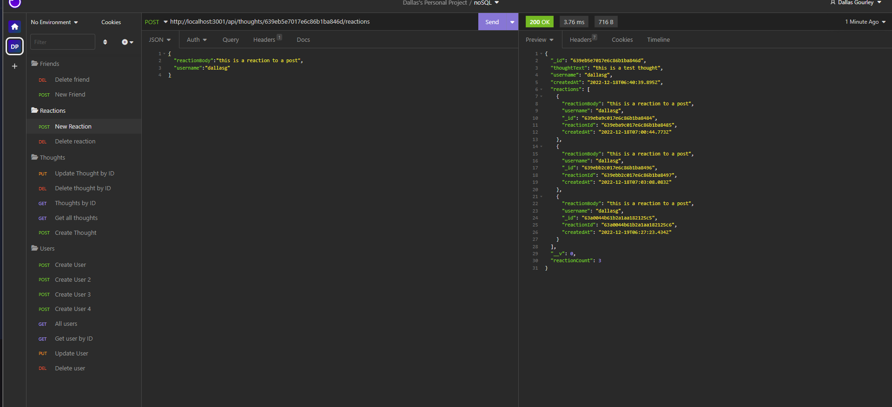

# Social Network

 [](https://opensource.org/licenses/MIT)

  This project is designed to emulate a social media api that allows a user to have friends, comments and reactions to comments. The application allows users to perform CRUD operations on the database.

  [A video of the app can be viewed here.](https://drive.google.com/file/d/1LyGMvAwbfEKZwerDrUbZ35jWCibrBiuZ/view)

  [The repository can be viewed here.](https://github.com/dgourley84/SocialNetwork)

  ---
## Contents
1. [About](#about)
    1. [Usage](#usage)
    2. [User Story](#user-story)
    3. [Acceptance criteria](#acceptance-criteria)
    4. [Visuals](#visuals)
2. [Installation](#installation)
3. [License](#license)
4. [Contributing](#contributing)
5. [Tests](#tests)
6. [Authors and acknowledgment](#authors-and-acknowledgments)
7. [Questions](#questions)
---
## About

  This project is designed to emulate a social media api that allows a user to have friends, comments and reactions to comments. The application allows users to perform CRUD operations on the database.

  The application shows responses on get requests as follows:

  

  The application also sends the updated or added fields as a response to PUT or POST requests.

  
  
  

  The video demonstration is viewable at the following link:

  https://drive.google.com/file/d/1LyGMvAwbfEKZwerDrUbZ35jWCibrBiuZ/view

---
## Usage
  
  Once installed and running using hte above commands, interact with the database in a tool like Insomnia.

---
## User Story
  ```bash
AS A social media startup
I WANT an API for my social network that uses a NoSQL database
SO THAT my website can handle large amounts of unstructured data
  ```

---
## Acceptance Criteria
  
  ```
GIVEN a social network API
WHEN I enter the command to invoke the application
THEN my server is started and the Mongoose models are synced to the MongoDB database
WHEN I open API GET routes in Insomnia for users and thoughts
THEN the data for each of these routes is displayed in a formatted JSON
WHEN I test API POST, PUT, and DELETE routes in Insomnia
THEN I am able to successfully create, update, and delete users and thoughts in my database
WHEN I test API POST and DELETE routes in Insomnia
THEN I am able to successfully create and delete reactions to thoughts and add and remove friends to a user’s friend list
  ```


---
## Installation:

  To Install and run this application yourself, follow the below step(s).

  ```
  npm i
  ```

  Followed by:

  ```
  npm start
  ```

---
## License
  License used for this project - MIT
  * For more information on license types, please reference this website
  for additional licensing information - [https: //choosealicense.com/](https://choosealicense.com/).
---

## Contributing:

  To contribute to this application, create a pull request.
  Here are the steps needed for doing that:
  - Fork the repo
  - Create a feature branch (git checkout -b NAME-HERE)
  - Commit your new feature (git commit -m 'Add some feature')
  - Push your branch (git push)
  - Create a new Pull Request
  Following a code review, your feature will be merged.

---

## Tests:

  This project does not include tests

---
## Authors & Acknowledgments

  Dallas Gourley

---

## Questions:
* GitHub Username: [dgourley84](https://github.com/dgourley84)
* GitHub Email: (dallas.gourley@yahoo.com)


